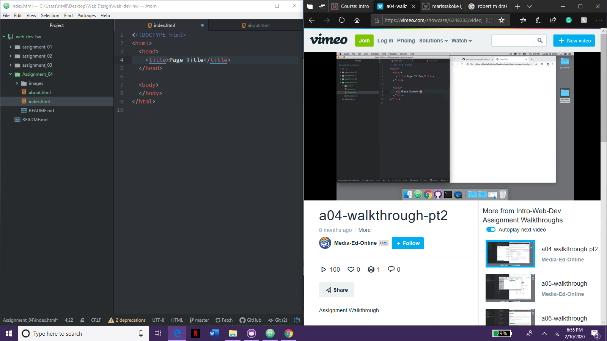

# Assignment 04

## Marissa Koke

1. I went to Yahoo! from 1996 and then went to a photography link that was given. It has a red Yahoo! logo with a help, add url, and more Yahoos, clickable images next to it in the upper left hand corner. It is completely different from what Yahoo! looks like today. The Yahoo today is purple and has under the search bar more links to different types of information.
2. The GIT Module was easy to use since I had used it before in a previous class. It was nice to get a refresher on how to use it and how helpful it is to use the desktop GIT Hub.

3. 
