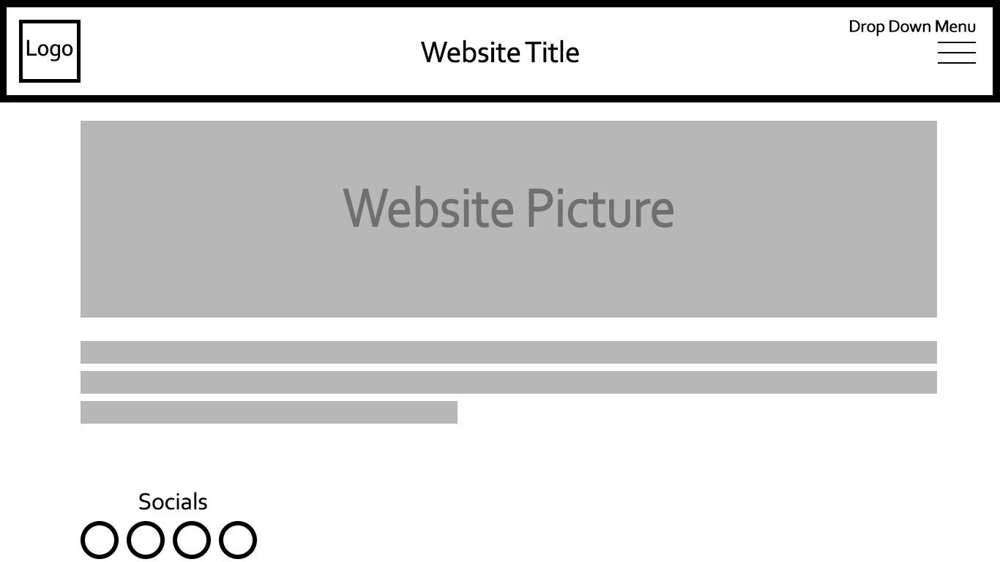

## Marissa Koke
### Assignment 11

1. The difference between padding, margin, and borders is, borders define the space an element can take up, and also helps for visualization, padding is the space between the elements inner content and the element itself, and the margin is the area between other elements and the box element.

2. 

3. This assignment was the most challenging out of all the others. I had a hard time with the margins. I tried to make my site pages to go to the right to imitate what I wanted in my sketch and they wouldn't. I don't feel 100% confident in working with margins and will practice more with them. Overall it was a good experience in creating a website and getting more understanding of how css works.
